# 🥦 NutriPlan — Master Architecture & System Design

NutriPlan is an enterprise-grade AI nutrition, clinical dietetics, and telemedicine platform. It connects patients with certified nutritionists, creates AI-curated and generative meal plans compliant with ICMR-NIN & USDA guidelines, ingests real-time wearable biometrics, and handles marketplace transactions.

---

## 🏛️ 1. High-Level System Architecture

```mermaid
graph TD
    subgraph Clients["Client Layer"]
        Web["Vue 3 + Tailwind Web App<br/>(Port 5173)"]
        Mobile["Flutter Mobile App<br/>(iOS & Android)"]
    end

    subgraph GatewayLayer["API Gateway & Documentation"]
        Gateway["FastAPI API Gateway<br/>(Port 8000)<br/>Aggregated OpenAPI / Swagger"]
    end

    subgraph EventMesh["Event & Workflow Backbone"]
        RedisStreams["Redis Streams<br/>(FastStream Broker :6379)"]
        TemporalServer["Temporal Server<br/>(Port 7233)"]
    end

    subgraph Microservices["Core Microservices"]
        AuthSvc["Auth Service (:8001)<br/>JWT & Roles"]
        ComplianceSvc["Compliance Service (:8002)<br/>ICMR-NIN & USDA Rules"]
        ProfileSvc["Profile & Pantry (:8003)<br/>MongoDB"]
        RecipeSvc["Recipe & Food DB (:8004)<br/>USDA / IFCT DB"]
        DiarySvc["Food Diary (:8005)<br/>Atomic Macro Tracking"]
        GrocerySvc["Grocery Service (:8006)<br/>Checklist Management"]
        SubSvc["Subscriptions (:8007)<br/>Referrals & Family Plans"]
        MealPlanSvc["Meal Plan Engine (:8009)<br/>Pydantic AI + Guardrails"]
        NotificationSvc["Notifications (:8010)<br/>Push & Email"]
        ChatSvc["Chat Service (:8012)<br/>Direct 1-on-1 Chat"]
        ApptSvc["Appointments (:8013)<br/>Temporal Saga Trigger"]
        VideoSvc["Video Service (:8014)<br/>Jitsi Telemedicine"]
        AIChatbotSvc["AI Chatbot (:8015)<br/>LangGraph Multi-Agent"]
        PaymentSvc["Payment Service (:8016)<br/>Stripe Connect & Payouts"]
        DeliverySvc["Delivery Service (:8017)<br/>Blinkit / Instacart"]
        WearableSvc["Wearable Service (:8018)<br/>HealthKit / Health Connect"]
        MarketplaceSvc["Marketplace (:8021)<br/>Nutritionist Directory"]
    end

    subgraph DataLayer["Databases & Cache"]
        Postgres["PostgreSQL (:5432)<br/>Auth, Plans, Diary, Subs, Appts"]
        Mongo["MongoDB (:27017)<br/>Recipes, Profiles, Notifications"]
        RedisCache["Redis Cache (:6379)"]
    end

    %% Client Routing
    Web --> Gateway
    Mobile --> Gateway
    Gateway --> Microservices

    %% Event-driven connections
    WearableSvc -- "steps_updated" --> RedisStreams
    RedisStreams -- "reactive TDEE update" --> MealPlanSvc
    MealPlanSvc -- "plan_generated" --> RedisStreams
    RedisStreams -- "push notification" --> NotificationSvc
    ApptSvc -- "appointment_booked" --> RedisStreams
    RedisStreams -- "trigger saga" --> TemporalServer
    TemporalServer -- "execute activities" --> PaymentSvc
    TemporalServer -- "provision room" --> VideoSvc
    TemporalServer -- "send confirmation" --> NotificationSvc

    %% Database persistence
    Microservices --> Postgres
    Microservices --> Mongo
    Microservices --> RedisCache
```

---

## 🧩 2. Microservice Directory & Port Registry

| Service | Port | Database | Primary Responsibility |
|---|---|---|---|
| **API Gateway** | `8000` | — | Aggregates OpenAPI specs from all 16 microservices into unified `/docs` and `/redoc` portals. |
| **Auth Service** | `8001` | Postgres (`nutriplan_auth`) | User signup, login, JWT token issuance, password hashing, and role checks (`patient`, `nutritionist`, `admin`). |
| **Compliance Service** | `8002` | In-memory / Rules | Regional rules engine (India ICMR-NIN 2020 & US USDA/FDA). Evaluates clinical condition flags (Diabetes, PCOS, CKD, Post-partum). |
| **Profile & Onboarding** | `8003` | MongoDB (`nutriplan_profile`) | Stores user biometrics, 4-step onboarding wizard data, allergy checklists, and pantry inventory. |
| **Recipe & Food DB** | `8004` | MongoDB (`nutriplan_recipes`) | Food database containing IFCT 2017 & USDA FoodData Central items with macro/micronutrient profiles per 100g. |
| **Food Diary** | `8005` | Postgres (`nutriplan_diary`) | Real-time meal logging, photo log entries, atomic daily macro aggregation, and trend analysis. |
| **Grocery List** | `8006` | Postgres (`nutriplan_grocery`) | Auto-generates weekly shopping lists from scheduled meal plans, categorised by aisle. |
| **Subscriptions** | `8007` | Postgres (`nutriplan_subscriptions`) | Tier billing (`Free`, `Premium`, `Family`, `Pro`), "Give a month, get a month" referral reward tracker, and family member invites. |
| **Meal Plan Engine** | `8009` | Postgres (`nutriplan_meal_plan`) | Generates curated and AI meal plans using **Pydantic AI** (Ollama/Llama3) enforced with a **Guardrails AI** safety layer. |
| **Notifications** | `8010` | MongoDB (`nutriplan_notifications`) | In-app alerts, email notifications, and mobile push triggers. |
| **Chat Service** | `8012` | MongoDB (`nutriplan_chat`) | Persistent text messaging between patients and assigned human nutritionists. |
| **Appointments** | `8013` | Postgres (`nutriplan_appointments`) | Nutritionist consultation scheduling and Temporal booking saga initiator. |
| **Video Service** | `8014` | In-memory | Telemedicine video consultation room generation via Jitsi Meet. |
| **AI Chatbot** | `8015` | Postgres (`pgvector`) / LLM | Stateful multi-agent chatbot powered by **LangGraph** (TriageAgent, ClinicalEscalationAgent, RecipeAgent, GeneralNutritionAgent). |
| **Payment Service** | `8016` | Postgres (`nutriplan_payments`) | Real **Stripe** integration: Stripe Connect Express accounts (80/20 fee split), PaymentIntents, and webhook listeners. |
| **Delivery Service** | `8017` | In-memory | Deep linking and basket transfer to grocery delivery partners (Blinkit, Instacart). |
| **Wearable Service** | `8018` | In-memory | Ingests Apple HealthKit and Google Health Connect biometrics and emits `steps_updated` events over FastStream. |
| **Marketplace** | `8021` | MongoDB (`nutriplan_marketplace`) | Verified nutritionist directory, self-serve onboarding, hourly rates, and specialties. |

---

## ⚡ 3. Event-Driven Architecture & Temporal Sagas

### FastStream (Redis Streams) Events:
1. **`steps_updated`**
   - **Publisher**: Wearable Service (`POST /api/v1/wearable/ingest/healthkit`)
   - **Subscriber**: Meal Plan Service recalculates Total Daily Energy Expenditure (TDEE) and adjusts today's remaining calorie target without blocking HTTP requests.
2. **`plan_generated`**
   - **Publisher**: Meal Plan Service (`POST /api/v1/plan/generate`)
   - **Subscriber**: Notification Service sends push alert to mobile client.
3. **`appointment_booked`**
   - **Publisher**: Appointment Service (`POST /api/v1/appointments/book`)
   - **Subscriber**: FastStream triggers the Temporal `BookingWorkflow`.

### Temporal Booking Saga (`BookingWorkflow`):
When a patient books an appointment, Temporal orchestrates a durable distributed transaction:
1. **`charge_stripe`**: Executes destination charge (80% to nutritionist, 20% platform fee). Automatically retries on network blips with exponential backoff.
2. **`provision_jitsi_room`**: Provisions a dedicated secure room URL for the video call.
3. **`send_confirmation_email`**: Dispatches calendar invite and join link to patient and nutritionist.
4. **`update_appointment_db`**: Atomically transitions appointment status from `pending` to `CONFIRMED`.

---

## 🛡️ 4. Security, Compliance & HIPAA Architecture

- **Shared Security Middleware**: CORS origins whitelist, Rate Limiting (SlowAPI), Max Body Size caps (10MB), and HTTP Security Headers (`X-Content-Type-Options`, `X-Frame-Options`, `Strict-Transport-Security`).
- **HIPAA Safe Harbor Module** ([`nutriplan_shared.hipaa`](file:///Users/anishganga/Project-nutri/backend/shared/src/nutriplan_shared/hipaa.py)):
  - Column-level AES-256-GCM field encryption for PII/PHI.
  - Safe logging redaction (`redact_phi` scrubs 18 Safe Harbor identifiers).
  - SHA-256 pseudonymisation for research analytics and `DeidentifiedRecord` export.
